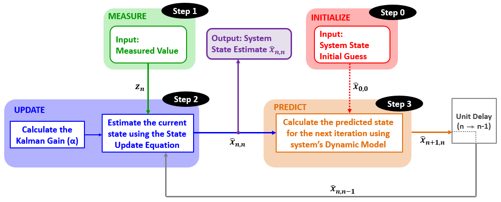

### Our Next Meeting

* When: April 2, 2026, 7:00 to 9:00pm
* Where: [Artisans Asylum](https://www.artisansasylum.com) (96 Holton Street, Boston, MA 02135))
* Register: [Register](https://brh.eventbrite.com)

### Agenda

* 7:00 Mingle, network, show and tell
* 7:30 Lightning Talks
    * Please send me ideas
* 7:45 Featured Speaker: Chris Lai on Kalman Filters 
* 8:30 Q&A and Open Discussion
* 9:00 End of formal meeting

### Kalman Filters

The Kalman Filter is a powerful and efficient tool used in robotics (and beyond) to improve the accuracy and precision of noisy predictions or sensor readings. The algorithm uses the temporal aspect of predictions over time, combined with a noise model of the measurements, to allow the estimate of a state to converge. In addition, the algorithm is also memory efficient and recursive, which doesn't need a computer to store massive amounts of data (compared to other similar averaging techniques). Overall, it helps solve the problem of uncertainty in robotics, bringing us one step closer to being able to help robots more accurately perceive the world around it.ß

Kalman Filters are used in some of the world's most advanced guidance, navigation, and control systems, including aircraft and spacecraft, in order to provide the ground station with accurate information about the craft's current and future state. However, the Kalman Filter is also applicable to hobby-level robotics, and can improve the stability and operation of the system when used correctly.

In this talk, we will go over the motivation behind the Kalman Filter, and describe why (and most importantly) how it is used. We will provide multiple examples of the filter used in robotics, both in software and hardware, and explain different ways where you can use the filter in your own projects.

#### Speaker: Chris Lai
Graduate of Cal Poly Pomona with a BS in Computer Engineering and has been teaching with BWSI for 3 years and is now working at MIT Lincoln Laboratory for 2 years.