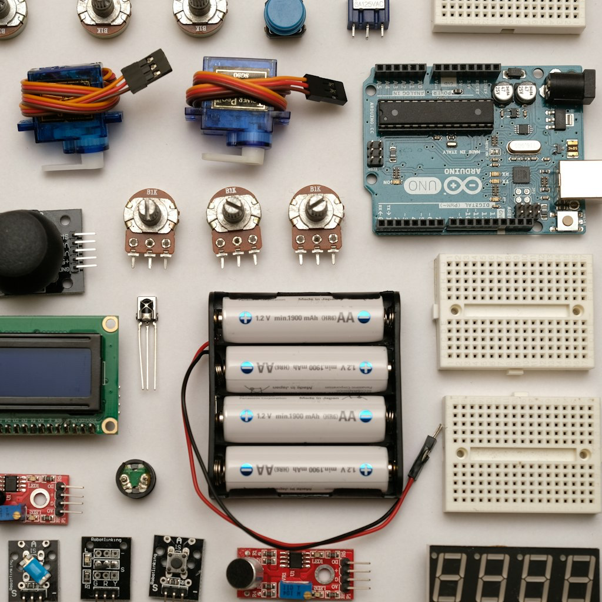
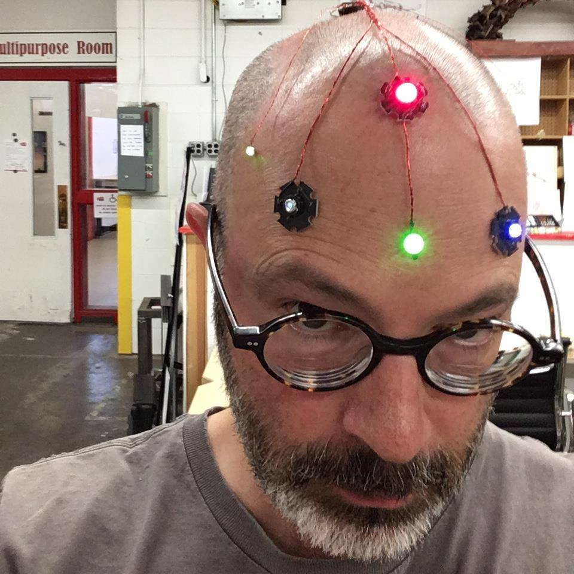

### Our Next Meeting

* When: September 3, 2026, 7:00 to 9:00pm
* Where: [Artisans Asylum](https://www.artisansasylum.com) (96 Holton Street, Boston, MA 02135))
* Register: [Register](https://brh.eventbrite.com)

### Agenda

* 7:00 Mingle, network, show and tell
* 7:30 Lightning Talks
    * Please send me ideas
* 7:45 Featured Speaker: Alan Kilian on Power Systems
* 8:30 Q&A and Open Discussion
* 9:00 End of formal meeting

### Power Systems for Robots

In his talk, [Alan](https://bostonrobothackers.com/members/alan-kilian.html) will explain the core elements of robot power systems by covering battery chemistries, physical formats, charge and discharge behavior, and the safety and environmental limits that define how those batteries can be used. He will then show how these fundamentals connect to practical voltage‑regulation methods, the ways power consumption is measured, and the control circuitry that helps a robot use its battery more efficiently and extend its operating life.

#### Speaker: Alan Kilian
He’s a retired software and firmware engineer with deep roots in high‑performance computing, long experience at Cray, and a lifelong passion for robotics. He founded and led multiple robotics communities, built countless projects, and continues to design and fabricate hardware using modern tools like OnShape and a Prusa MK4S.
