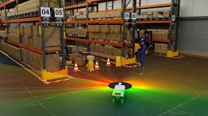

### Meeting Announcement

* When: May 7, 2026, 7:00 to 9:00pm
* Where: [Artisans Asylum](https://www.artisansasylum.com) (96 Holton Street, Boston, MA 02135))
* Register: [Register](https://brh.eventbrite.com)

### Agenda

* 7:00 Mingle, network, show and tell
* 7:30 Lightning Talks
* 7:45 Featured Speaker: Adam Ring on Simulations
* 8:30 Q&A and Open Discussion
* 9:00 End of formal meeting

### Simulations!

Simulation is one of the most powerful tools available to robotics engineers, from hobby projects on a Raspberry Pi to large-scale production systems using cutting-edge hardware. We are very fortunate to have [Adam Ring](https://www.linkedin.com/in/adam-ring-7166a319b/), an expert in Simulation for Robotics to share with us how the right simulation approach can accelerate development, improve safety, and reduce costly real-world failures.
 

The term "simulation" encompasses a wide range of tools and techniques, and you'll need to know how to choose the right tool for your job. Lightweight mocks for testing software interactions, full physics-based environments for validating robot behavior, and synthetic data generation each serve distinct purposes and knowing when to reach for each is half the battle. Drawing from 3D warehouse simulation for autonomous robots and systems-level simulation of complex software interactions in an autonomous warehouse, this talk covers what simulation looks like across different scales and layers of a robotic system.
 
Designing your project with simulation in mind from day one pays dividends: modularizing components, decoupling from system time, and building in state transparency all make closing the gap between simulation and reality far more manageable, whether you're hacking at home or shipping production code.
 
Whether you are starting to use simulation for a personal project or looking to elevate your testing practices for production robotics, this talk will leave you with a framework for thinking about simulation at every stage of development. With AI-assisted tooling rapidly lowering the barrier to entry, there has never been a better time to make simulation a core part of how you build.
 
Speaker: Adam Ring Adam is a robotics software engineer with industry experience at Vecna Robotics and Symbotic. He has worked on warehouse simulation for autonomous robots and systems-level simulation of complex software interactions in large-scale robotics infrastructure.