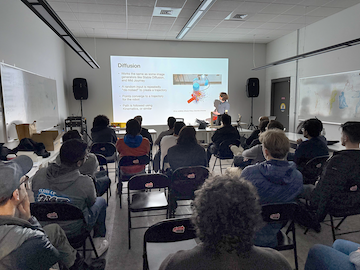
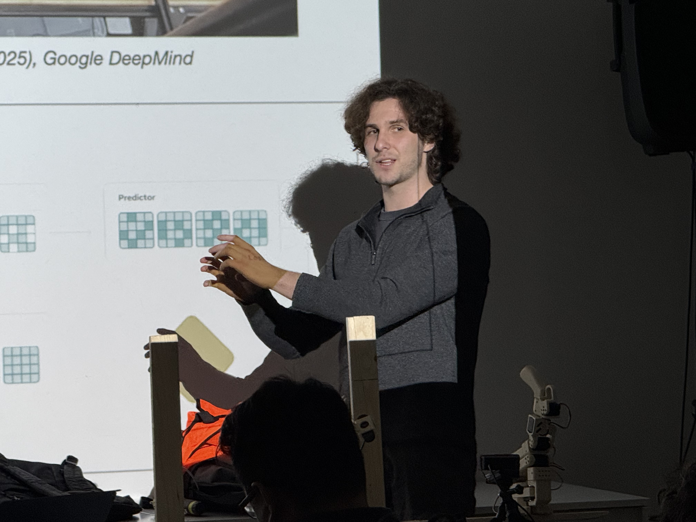

<h2>We are making progress!</h2>

Progress measued by having the most number of signups on Eventbrite (35) and actual attendance (25). But also measured by word of mouth. We had many first time attendees. They said they were glad to have discovered this group and complimented the presentations. Please continue to spread the word. 

### Lightning Talk

We had the first BRH "Lightning Talk" by Caspian Chaharom. Caspian shared hisamazing product -- [AutoPCB](https://autopcb.app) for PCB design and manufacturing. If people are interested Caspian has offered us access to the product and maybe a workshop / tutorial session sometime early next year.

### Main Talk on VLAs

Our main presentation from Skyler on [VLAs](https://en.wikipedia.org/wiki/Vision-language-action_model) -- Visual Language Action Models. The talk was well received with many questions, most over MY head. Skyler is interested in sharing his work any of us. He is sharing a [library with his code](https://github.com/avla-robotics/leopenpi), which is a python client for the LeRobot to connect to an OpenPI server, which allows you to run PI0/PI0.5 on it without your own GPU.

### HACKERSWEET™

<video style="float: right; margin: 25px 25px 25px 25px; border-radius: 8px; height: 300px;" controls>
  <source src="../../images/meetings/armcookie.MOV">
  Your browser does not support the video tag.
</video>

Finally We had another edition of Chris' **HACKERSWEET™**s. Let me know if you want me to start posting the recipes. Yes, they are all homemade! And yes, bringing it all together, we saw Skyler's arm (robot arm that is) pick up a **HACKERSWEET™** and feed it someone

