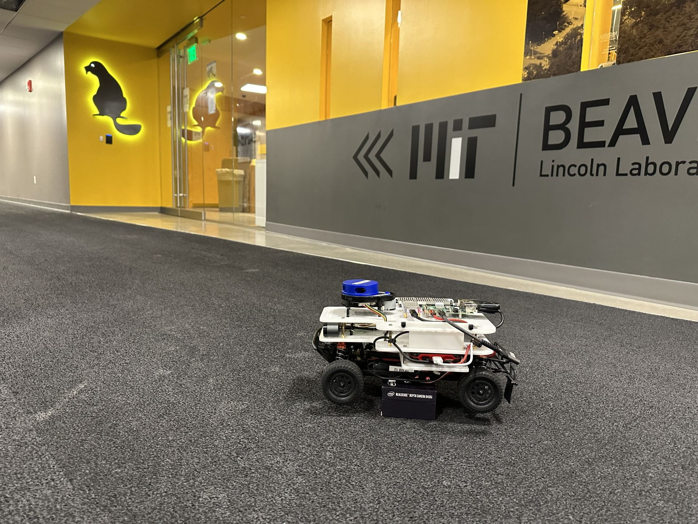

## Our Next Meeting

* When: December 11 at 7:00 to 9:00pm
* Where: [Artisans Asylum](https://www.artisansasylum.com) (96 Holton Street, Boston, MA 02135))
* Register: [Register](https://brh.eventbrite.com)

**We hope that you will join us for our next meeting.**

## Agenda

* 7:00 Mingle, network, show and tell
* 7:30 Lightning Talks
    * Varun Raghavendra will give a brief talk about his project LeKapda, that envisions a world where every home runs smarter, cleaner, and freer through open-source laundry automation.
    * Buddy will give a 5-10 minute talk on his use of ROS Bag Traces with his shell script.
* 7:45 Featured Speakers: Joel Grimm and Christopher Lai
* 8:30 Q&A and Open Discussion
* 9:00 End of formal meeting

## Autonomous RACECAR at MIT's Beaver Works Summer Institute

This course has been evolving for 10 years as part of BWSI, originally a course to teach programming and autonomous systems to MIT graduate and undergrad students, it's now used to bring students as young as middle school into autonomous robotics!  We'll describe the course and our approach to teaching it to students over a wide age range and skill level and provide information about the BWSI program.

#### Speaker: Chris Lai
Graduate of Cal Poly Pomona with a BS in Computer Engineering and has been teaching with BWSI for 3 years and is now working at MIT Lincoln Laboratory for 2 years.

#### Speaker: Joel Grimm
Graduate of University of Rochester and has been working at MIT Lincoln Laboratory for 39 years, and has been managing the Beaver Works Center at MIT for the last 8 years, bringing projects and experience to MIT undergrads and collaborations with faculty.

