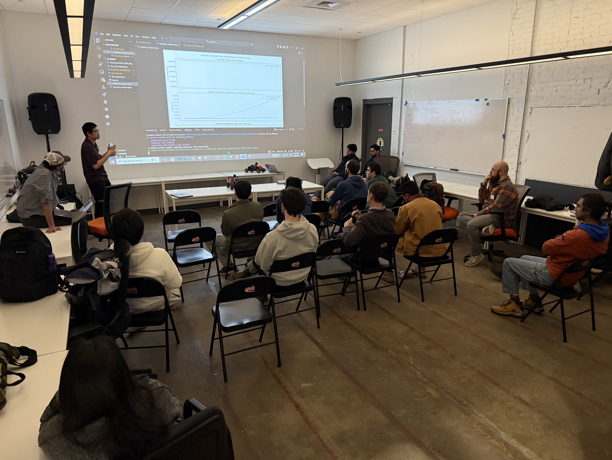
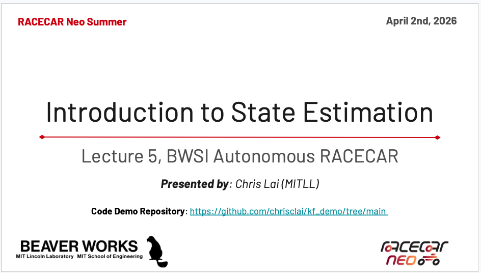
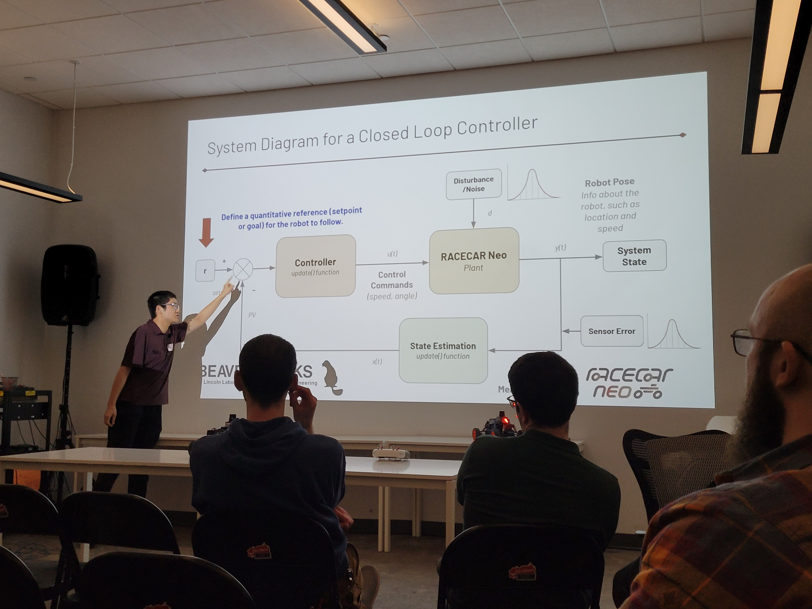
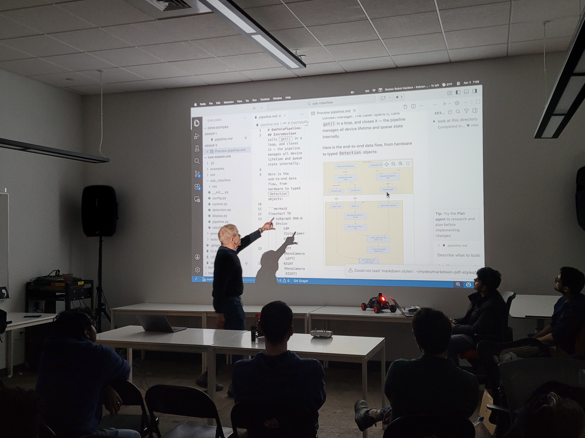
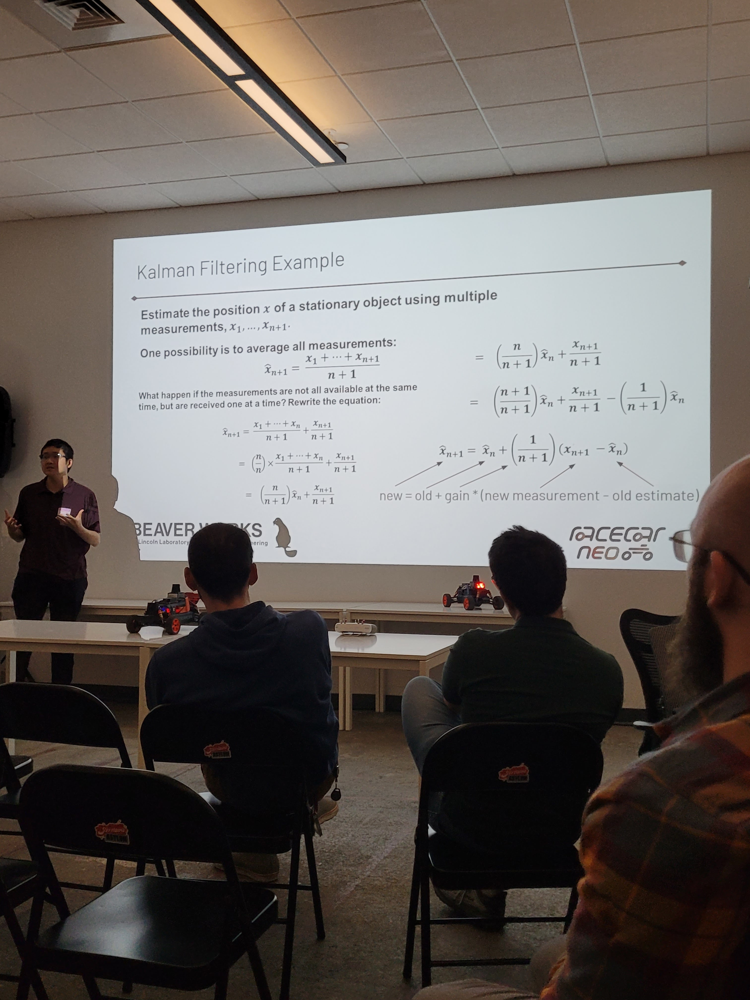

### The meeting

We had one of the better turnouts for our meeting this week. About half repeat guests and half new people. Here are the slides that Chris used for his talk. There is a fair bit of mathematics in it, but I learned a lot!

Chris started with some fundamentals: sensors are inherently and always noisy. If you show the acceleration data produced by an IMU (inertial measurement unit) you will see a wildly squiggly graph -- even if the robot is stationary! Simple approaches of averaging and moving averages can be tried but they don't get you that much further. Then Chris introduced some variations of the Kalman filters and showed, in code and graphs how the estimates for the position of the robot converge pretty quickly to the correct value.

### Links
Here are some of Pito's favorite resources related to the Mighty Kalman Filter:

* [A non-mathematical introduction to Kalman Filters](https://praveshkoirala.com/2023/06/13/a-non-mathematical-introduction-to-kalman-filters-for-programmers/?utm_source=hackernewsletter&utm_medium=email&utm_term=fav)
* [How a Kalman Filter Works, in pictures](https://www.bzarg.com/p/how-a-kalman-filter-works-in-pictures/)
* [Kalman Filter For Dummies](https://bilgin.esme.org/BitsAndBytes/KalmanFilterforDummies)
* [Youtube About Kalman Filters](https://www.youtube.com/embed/CaCcOwJPytQ)

And here are Chris'
* [Builds from Fundamentals](https://kalmanfilter.net)
* [Derivation of the filter](https://web.mit.edu/kirtley/kirtley/binlustuff/literature/control/Kalman%20filter.pdf)

### Slides

### Pics

