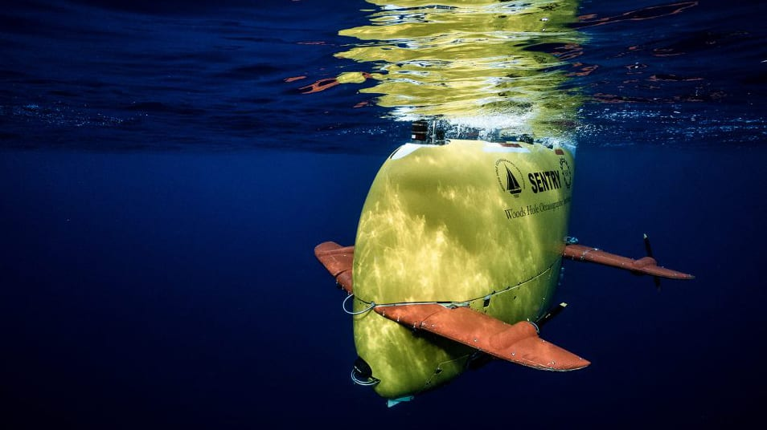

### Meeting Announcement

* When: July 9, 2026, 7:00 to 9:00pm
* Where: [Artisans Asylum](https://www.artisansasylum.com) (96 Holton Street, Boston, MA 02135))
* Register: [Register](https://brh.eventbrite.com)

### Agenda

* 7:00 Mingle, network, show and tell
* 7:30 Lightning Talks
    * Update on Pupper
    * Update on Hands on meetings
* 7:45 Featured Speaker: Isaac Vandor on Underwater robotics
* 8:30 Q&A and Open Discussion
* 9:00 End of formal meeting
 
### Featured Talk

Our July 9th main speaker will be Isaac Vandor, who is the organizer for the ROS Maritime Community Working Group.  Isaac works at Woods Hole Oceanographic Institute (WHOI) on Cape Cod.  WHOI has been one of the early adopters of ROS 1 and 2 in the marine robotics community.   Isaac is the lead developer and maintainer for WHOIDSL software, with code running on HOV Alvin, ROV JASON, and AUV Sentry.  He is also active in initiating an Open Ocean Software open source marine robotics ecosystem.  Isaac will talk about his work and experiences with underwater maritime robotics.

Speaker: [Isaac Vandor](https://isaacvandor.com) Is currently a Robotics Software Engineer in the Deep Submergence Lab at Woods Hole Oceanographic Institution. Isaac is the lead developer and maintainer for WHOIDSL software, with code running on HOV Alvin, ROV JASON, and AUV Sentry. Isaac is known for designing and developing new capabilities for our ROS software ecosystem in addition to GUIs and other tools for operator interaction.