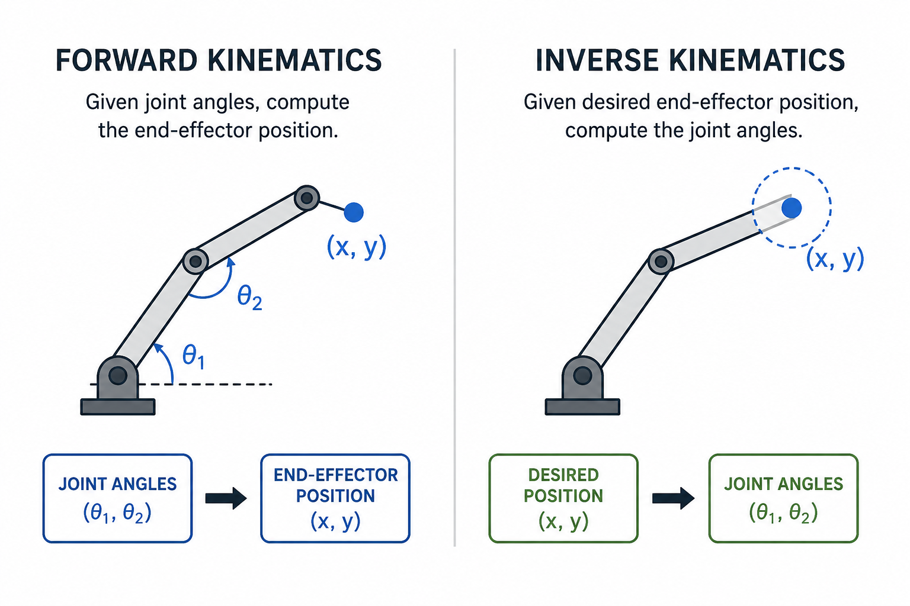

### Meeting Announcement

* When: August 8, 2026, 7:00 to 9:00pm
* Where: [Artisans Asylum](https://www.artisansasylum.com) (96 Holton Street, Boston, MA 02135))
* Register: [Register](https://brh.eventbrite.com)

### Agenda

* 7:00 Mingle, network, show and tell
* 7:30 Lightning Talks
    * TBD
    * TBD
* 7:45 Featured Speaker: Shivam Chopra
* 8:30 Q&A and Open Discussion
* 9:00 End of formal meeting
 
### Featured Talk

## Forward & Inverse Kinematics: The Math: From joint angles to end-effector poses — and back again

Every robotic arm faces the same two fundamental questions: given these joint angles, where is the end-effector? (forward kinematics) — and the harder one: given a target, what joint angles get me there? (inverse kinematics). The math behind both questions is something every roboticist eventually has to reckon with, and this talk is a ground-up walk through it.

We'll start with the building blocks — rotation matrices, homogeneous transforms, and the Denavit-Hartenberg convention — and use them to derive FK for a serial manipulator step by step. Then we'll flip the problem: IK is generally non-linear, often has multiple solutions(or none), and can't always be solved in closed form. We'll cover geometric approaches for simple cases, Jacobian-based numerical methods for the general case, and where things break down near singularities.

The goal is that you leave with enough intuition to read a kinematics derivation, implement a basic solver, and know which approach to reach for on your own robot — whether it's a 3-DOF desktop arm or something more exotic.

## Speaker: Shivam Chopra

Our August 8 main speaker will be Shivam Chopra, PhD, who is a Senior Medical Device Engineer and Subsystem Technical Lead at Dexcom, where he leads electromechanical architecture and validation for next-generation wearable platforms. He holds a PhD in Mechanical Engineering (Robotics) from UC San Diego, where his research in the Gravish Lab spanned underactuated locomotion and sensing in granular and underwater environments. His robot was the fastest untethered digging robot that could sense obstacles. With 10+ years across robotics R&D, automation, and hardware-software integration, Shivam brings both the theory and the scars of making robots actually work.

