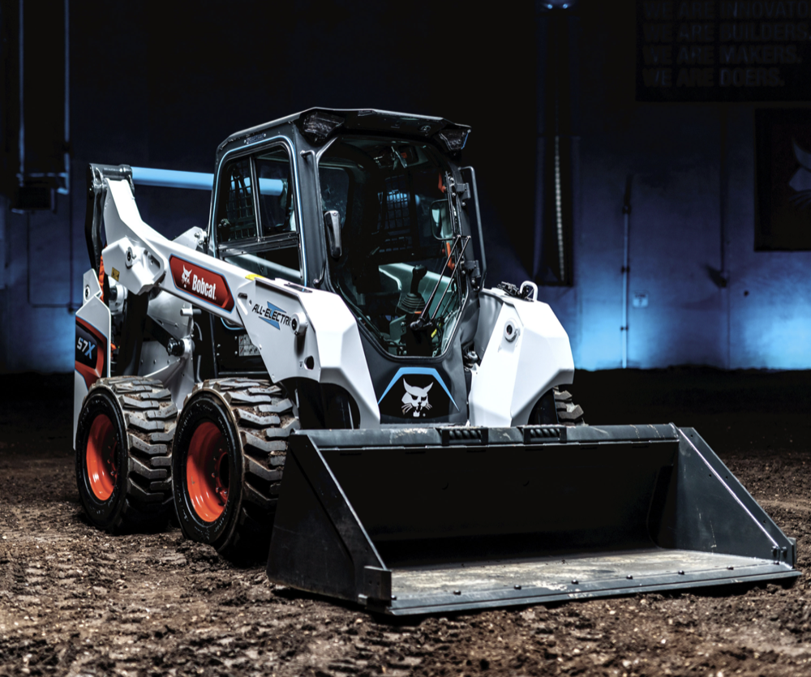

### Meeting Announcement

* When: Thursday, November 12, 2026, 7:00 to 9:00pm
* Where: [Artisans Asylum](https://www.artisansasylum.com) (96 Holton Street, Boston, MA 02135))
* Register: [Register](https://brh.eventbrite.com)

### Agenda

* 7:00 Mingle, network, show and tell
* 7:30 Lightning Talks
    * TBD
    * TBD
* 7:45 Featured Speaker: Yun Chang
* 8:30 Q&A and Open Discussion
* 9:00 End of formal meeting

### Featured Talk

#### Robot Scene Understanding for Extreme Environments: from subterranean to heavy equipment

Yun will share experience from the DARPA Subterranean Challenge — where robots had to build and act on scene understanding in dark, GPS-denied, unpredictable underground environments — and from current startup work bringing autonomy to heavy equipment: the large machines that run society's infrastructure.

Watch highlights from both efforts:

* [DARPA Subterranean Challenge](https://www.youtube.com/watch?v=s_1roVVAXNU)
* [Autonomous heavy equipment](https://youtu.be/K1Y4iOUN7iU)

#### Speaker: Yun Chang

Yun spent a decade at MIT earning a Bachelor's, Master's, and PhD, working in the SPARK Lab under Professor Luca Carlone. The research centered on robot perception — compressing the world into representations a machine can act on. Yun is now co-founding a stealth startup bringing autonomy to the large machines that run society's infrastructure.