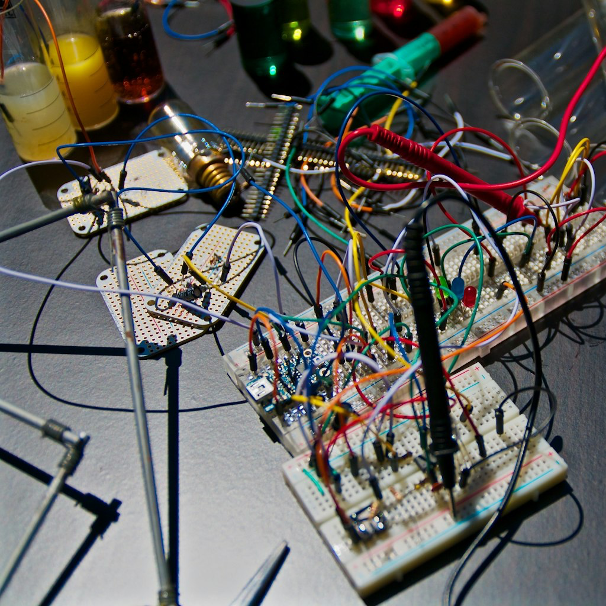

### TLDR

* What: Hands-on workshops with experts for project help, explanations, teaching, and mentoring.
* Project Focus: Building “moderately advanced” robots, moving beyond simple block-GUI programming and towards more complex systems like ROS2.
* Club Goal: Filling the gap for individuals interested in building robots with their own hands, focusing on practical skills and advanced projects.
* Meeting Purpose: To have a hands-on meeting with robots and other widgets for discussion and problem-solving.
* Meeting Date and Time: October 23rd, at the usual place and time.
* Meeting Format: A two-hour meeting without a set agenda, where participants bring their own robots or kits for help and discussion.

### Background

My original hope for this group was that it would be for like-minded folks attempting some moderately-advanced robotics, such as what was taught at Brandeis, or for example, Buddy's work with underwater robots and so on. I do realize that many of our members are not there yet, but the important thing is that they are seriously interested in getting there. No doubt this is more challenging and will require a greater commitment. But the payoff will be far greater and the carreer and resume impact greater.

Another premise of this group was that we want to build things, we want to write software and build hardware. There are other groups focused on the Robotics Industry, academic robotics research and developments, entrepreneurship and starting companies. The gap we are trying to fill is people who hope to actually build things with their own minds and hands.

### Focus

In our monthly meetings and online We have had discussions in the meetings as well as offline about somehow doing projects together, hands-on, so we can learn from each other. Some of our members are more advanced and are in a position to help others level up. We will not focus on very simple robots but on what we might call "moderatelhy advanced" robots. (I am open to a better phrase :)

So what is a "moderately-advanced" robot? In my mind, one that uses ROS2 qualifies, but it's not limited to that. There are options other than ROS2 tha are equally advanced (more on that later.) But I would exclude robots that are programmed only with block-GUIs. I would exclude robots that are used in high school or elementary schools. They are too simple and would not impress anyone during an interview. I would exclude robots that are fancy remote control cars. So it's not hard and fast, but it leans towards "moderatly advanced".

### Hands-On Meetings

This is an experiment! We have scheduled two "hands-on" meetings. The first one will be on Oct 23. The usual place and time. I will announce it separately. A few of us (Buddy, Pito, Ken) will bring some partial robots or other widgets from our workshops to serve as props for discussion. If you acquire a robot or robot kit before and want help building it or debugging it, bring it along. It will be a two hour meeting, without an agenda or a talk. We might sit around one big table (depending what facilities we are using). I would hope that everyone participates and gets involved. And through discussion and looking at what stuff was brought we will figure out what happens.