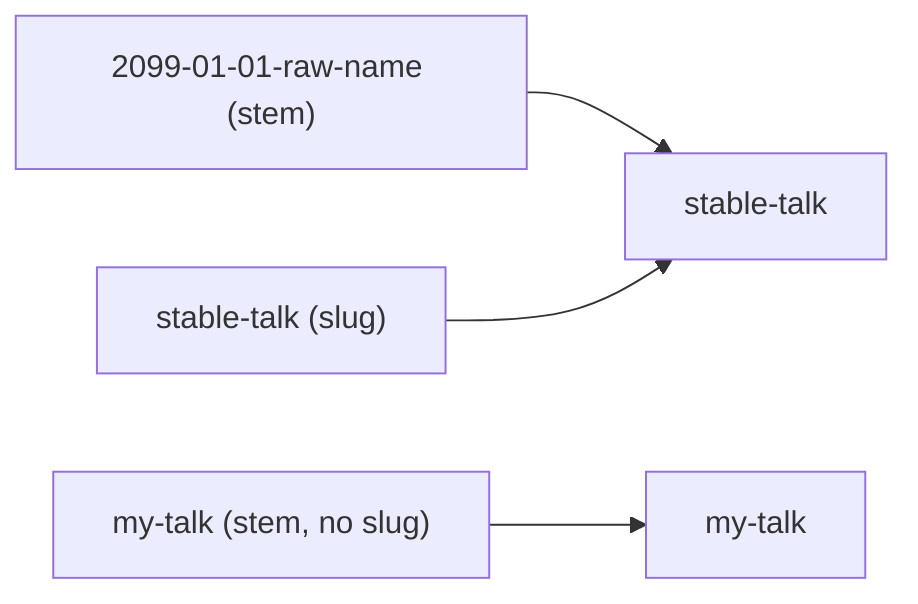

# news_links — turning a meeting's "see this post" into a real URL

## What problem this module solves

Meetings and news posts live in separate content folders. A meeting file says
*"my announcement is `26-arjun-viswanathan-talk-announcement.md`"*, and several
parts of the build need to turn that reference into the HTML page it became.

That sounds like string surgery, but there are two wrinkles:

- A news post may set a **`slug`** in its frontmatter, which renames its output
  page. The reference in the meeting may use either the filename stem or the slug.
- A reference can be **absent** (the report isn't written yet) or **broken** (a
  typo, a deleted file). Those two cases must behave very differently.

`news_links` is the single place that knows these rules, shared by
`content_manager` and `page_builder` so they can never disagree.

## The index: every name a post answers to

The core data structure is a flat `dict[str, str]` from *any accepted reference*
to the *output id* (the HTML filename without `.html`).

```python
for f in news_dir.glob("*.md"):
    slug = frontmatter.load(f).metadata.get("slug")
    out_id = slug or f.stem
    mapping[f.stem] = out_id
    if slug:
        mapping[slug] = out_id
```

- Every post is reachable by its **filename stem**.
- A slugged post is *also* reachable by its **slug**, and both keys point at the
  slug, because the slug is what the page is published as.

This is a classic *alias table*: many keys, one canonical value. It makes
renaming a file harmless as long as the slug stays put.



## Absent vs. broken: the one rule that matters

`resolve_news_html` returns `(html_filename, exists)`, and it treats the two
failure modes differently on purpose:

```python
if not ref:
    return "", False
key = str(ref).rsplit(".", 1)[0]  # tolerate .md/.html suffixes
if key not in index:
    raise ValueError(f"Unresolved news reference: {ref!r}")
return f"{index[key]}.html", True
```

- **No reference** is a legitimate state: callers get `exists=False` and simply
  don't render a link.
- **A reference that doesn't resolve** is a *content bug*. It raises, so the
  build fails loudly instead of quietly dropping a link that someone expected to
  be there.

This is the project's *report, don't guess* rule in miniature. A silent `None`
here would ship a site with missing links and nobody would notice.

The suffix tolerance (`.md` or `.html`) is the one deliberate leniency. Authors
naturally write the filename they see, and stripping a known extension is not a
guess about intent.

## NewsResolver: build the index once

Building the index reads the frontmatter of every news file, so it isn't free.
`NewsResolver` wraps the index with **lazy, build-once caching**:

```python
def resolve(self, ref: str) -> tuple[str, bool]:
    if self.index is None:
        self.index = build_news_index(self.news_dir)
    return resolve_news_html(self.index, ref)
```

- The first `resolve()` pays the O(n) scan; every later call is an O(1) dict
  lookup.
- The cache lives on the instance, so each `ContentManager` / `PageBuilder`
  gets one scan per build, not one per meeting.

## extract_slides_pdf: a small sibling

A report post can carry a `slides_pdf` path, shown as a download button on the
meeting page. `extract_slides_pdf` reads it directly from the post's
frontmatter, raising if the referenced file doesn't exist and returning `None`
when the field is simply unset, the same absent-vs-broken split as above.

## Observations and possible improvements

1. **`extract_slides_pdf` ignores slugs.** It looks up `news_dir / f"{key}.md"`
   directly, so a report referenced by its slug (rather than its stem) would
   raise. Routing it through the index would make it consistent with
   `resolve_news_html`.
2. **The index is never invalidated.** That's fine for a one-shot build, but a
   future watch/serve mode would need a way to rebuild it.
3. **Duplicate slugs silently collide.** Two posts with the same slug would map
   to one output id; the second overwrites the first. Detecting that at index
   time would turn a confusing broken link into a clear error.
