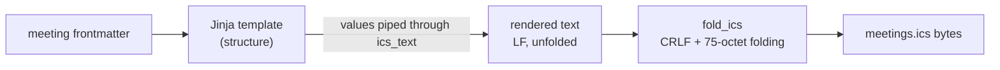
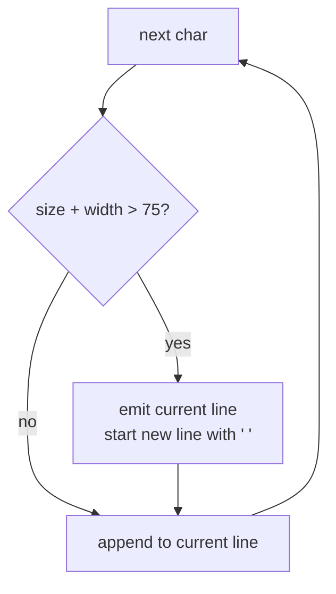

# ical_format — the RFC 5545 mechanics a template can't do

## Why this module exists

The meetings calendar feed (`output/meetings.ics`) is rendered from a Jinja
template, which is the right tool for *structure*: which properties each event
has and in what order. But the iCalendar standard, **RFC 5545**, also has
byte-level rules that a template can't enforce reliably:

- **Text escaping.** Commas, semicolons, backslashes, and newlines inside a
  value must be escaped, or a calendar client will split or truncate fields.
- **CRLF line endings.** Every line ends in `\r\n`, not `\n`.
- **Line folding.** No line may exceed **75 octets**; longer lines continue on
  the next line, which starts with a single space.

This module holds exactly those three mechanics, plus parsing the meeting
`time` field, and nothing else.



## Parsing meeting times strictly

Meeting files say things like `time: "7:00pm"`. The feed needs a real
`datetime.time`, so `parse_meeting_time` converts it:

```python
MEETING_TIME_PATTERN = re.compile(r"(1[0-2]|[1-9]):([0-5][0-9])(am|pm)")

match = MEETING_TIME_PATTERN.fullmatch(str(value or ""))
if not match:
    raise ValueError(f"meeting time must look like '7:00pm', got {value!r}")
hour, minute, meridiem = int(match[1]), int(match[2]), match[3]
return time(hour % 12 + (12 if meridiem == "pm" else 0), minute)
```

- The regex accepts **exactly one shape**. `7pm`, `19:00`, and `7:00 pm` are
  rejected rather than "helpfully" interpreted. A calendar event at the wrong
  hour is worse than a failed build.
- The **12-hour clock arithmetic** is the classic trick: `hour % 12` maps 12 to
  0, then adding 12 for `pm` gives 12pm → 12:00 and 12am → 00:00, the two cases
  that naive `hour + 12` gets wrong.

## Escaping text values

`ics_text` is registered as a Jinja filter and applied to every free-text value
(summary, description, location):

```python
str(value)
.replace("\\", "\\\\")
.replace(";", "\\;")
.replace(",", "\\,")
.replace("\r\n", "\\n")
.replace("\n", "\\n")
```

**Order matters.** Backslash must be escaped *first*; otherwise the backslashes
introduced by the later replacements would themselves be doubled. `\r\n` is
handled before bare `\n` so a Windows line ending becomes one escaped newline,
not a stray `\r` plus a newline.

A useful consequence: after escaping, **no real value can contain a raw
newline**. `fold_ics` relies on that.

## Folding lines on character boundaries

The 75-octet limit is measured in **bytes**, but the meeting descriptions
contain em dashes (`—`), which are three bytes in UTF-8. Folding by byte offset
could cut a character in half and produce invalid UTF-8. `fold_line` therefore
walks the line **character by character**, tracking the encoded width:

```python
for char in line:
    width = len(char.encode("utf-8"))
    if size + width > MAX_LINE_OCTETS:
        pieces.append(current)
        current, size = " ", 1
    current += char
    size += width
```

- Each continuation piece starts with a space, and that space **counts toward**
  its 75 octets (hence `size = 1`).
- This is a *greedy* packing: fill each line as far as possible, then break.
  Greedy is optimal here because every character must stay in order and there
  is no cost to breaking anywhere else.



## Assembling the final text

`fold_ics` turns rendered template text into the finished file body:

```python
lines = [line for line in text.splitlines() if line.strip()]
return "".join(
    piece + CRLF for line in lines for piece in fold_line(line.rstrip())
)
```

Blank lines are dropped. They can only come from **template layout**
(`` / `` tags on their own lines), never from content, because
`ics_text` already escaped every newline inside a value. That lets the template
stay readable without fragile whitespace-control markers.

## Observations and possible improvements

1. **`rstrip()` can drop meaningful trailing spaces.** A `SUMMARY` that genuinely
   ends in a space would lose it. Harmless for this content, but worth knowing.
2. **The time format is intentionally narrow.** If meetings ever need 24-hour
   times or durations in content, extend the regex rather than loosening
   validation elsewhere.
3. **Folding is correct but not pretty.** Real-world clients accept it; if
   readability of the raw file ever mattered, folding at word boundaries (still
   within 75 octets) would be a cosmetic upgrade.
