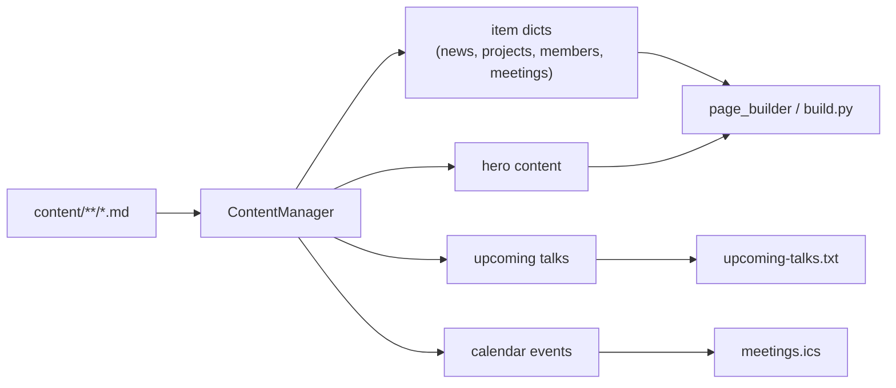
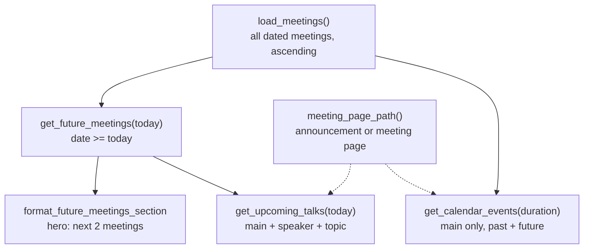

# content_manager — from Markdown files to structured content

## What this module does

The whole site is generated from Markdown files with YAML frontmatter under
`content/`. `content_manager` is the layer that **reads those files and hands
the rest of the build clean Python dicts**: parsed dates, rendered HTML,
validated meeting kinds, and derived views like "upcoming talks" or "calendar
events".

It deliberately knows nothing about HTML page layout. That belongs to
`page_builder` and the Jinja templates.



## Validate at the boundary: dates and meeting kinds

Two small module-level functions encode the project's **"report, don't guess"**
rule, and everything else leans on them.

**Dates** must be ISO `YYYY-MM-DD`:

```python
if not date_str:
    return None
try:
    return datetime.fromisoformat(str(date_str))
except ValueError as e:
    raise ValueError(
        f"Invalid date {date_str!r}: expected ISO format YYYY-MM-DD"
    ) from e
```

- Empty means "no date", which is a legitimate state.
- Anything else non-ISO is a **content bug** and fails the build. There is no
  attempt to parse "Oct 15" or "15/10/2026".

**Meeting kinds** must be explicit:

```python
kind = metadata.get("kind")
if kind in ("main", "handson"):
    return kind
raise ValueError(f"meeting 'kind' must be 'main' or 'handson', got {kind!r}")
```

The alternative, inferring the kind from the title ("Hands-On" in the name?),
is exactly the kind of guess that silently breaks when someone writes a title
differently.

`format_long_date` is the display counterpart: it renders "Thursday, October 5,
2026" without zero-padding by building the string from `%A`, `%B`, `.day`, and
`%Y`, avoiding the non-portable `%-d`.

## Loading one file

`process_markdown_file` is the unit of work. It returns a uniform dict whatever
the content type:

- `content`: Markdown rendered to HTML (with code highlighting, tables, and a
  table of contents).
- `toc_tokens`: the headings, for detail-page navigation.
- `reading_time`: words ÷ 200, minimum 1 minute.
- `metadata`: the raw frontmatter, which stays the **source of truth**.

One subtle step normalizes dates. YAML parses `date: 2026-10-15` into a Python
`date` object, while quoted dates stay strings. The loader converts both to one
ISO string and validates it *here*, naming the file on failure, so a bad date
anywhere fails with a useful message.

## ContentType: one loader, many kinds of content

Rather than one loader per content kind, a small **configuration object**
describes each kind (directory, sort key, templates), and `get_all_content`
does the rest:

- Files starting with `_` are skipped as scaffolding.
- Members get hashtag validation (a warning, not a failure).
- Meetings get `classify_meeting` validation (a failure).
- Items are sorted by `order`, by date (parsed, so it's chronological not
  lexical), or by any other field.

This is the *table-driven* pattern: behavior varies by data, not by subclass.

## The meeting pipeline

Meetings are the richest content type, and several views are derived from
them. They share one loader:



### load_meetings

Reads every meeting's frontmatter, skips undated files, validates dates, and
returns `{id, metadata, date_obj, title}` sorted ascending. `id` is the slug or
filename stem, which is what the meeting's detail page is named after.

### get_future_meetings

A filter over `load_meetings`. It takes an optional `today` so tests can
**freeze time**; production passes nothing and gets the real date.

### get_upcoming_talks

The data behind `upcoming-talks.txt`. A meeting qualifies only if all three
hold: it's in the future, it's a `main` meeting, and it has **both** `speaker`
and `topic`.

```python
if classify_meeting(metadata) != "main":
    continue
if not (metadata.get("speaker") and metadata.get("topic")):
    continue
```

The speaker/topic requirement is a neat trick: a TBA meeting simply *drops out*
until someone fills in those fields. No separate "is this confirmed?" flag is
needed.

### get_calendar_events

The data behind `meetings.ics`. Unlike talks, it keeps **past** meetings too,
because subscribers' calendars would otherwise lose history. Each event gets a
timezone-aware start:

```python
start = datetime.combine(meeting["date_obj"], start_time, tzinfo=BOSTON)
```

`BOSTON` is `ZoneInfo("America/New_York")`, so daylight saving is handled by the
IANA tz database, not by hand-coded offsets. The end is start plus a configured
duration, because content has no end times.

### meeting_page_path

One rule shared by both views: link to the meeting's **announcement** post if it
resolves, else to the meeting's own detail page. Having it in one place keeps
the text list and the calendar pointing at the same URL.

## Hero content

`build_hero_content` loads `content/heroes/<page>.md`. For the home page, the
Markdown contains an `<hr>`: everything above is static, and everything below
is **replaced** by a rendered "next two meetings" snippet. It's a simple
*template slot* convention that keeps the hero editable as plain Markdown.

## Observations and possible improvements

1. **The file is past the ~300-line guideline** (about 390 lines). The meeting
   pipeline (`load_meetings` through `get_calendar_events`) is a natural
   candidate to move into its own `meetings.py` module.
2. **Meetings are parsed twice.** `get_all_content` and `load_meetings` both
   read meeting files, with slightly different rules (the latter doesn't skip
   `_` files). Unifying them would remove a subtle divergence.
3. **`get_all_content` has a pre-existing `noqa` for branch complexity.** The
   per-type special cases (members, meetings) could move onto `ContentType` as
   optional validator callables.
4. **Config is read in the constructor** for hashtags only, while `build.py`
   separately loads the same `site.json`. Passing the loaded config in would
   remove the duplicate read.
