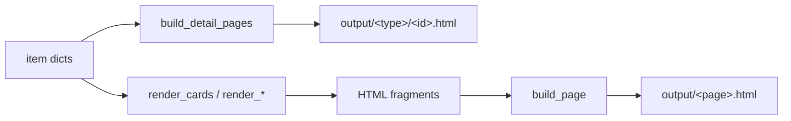
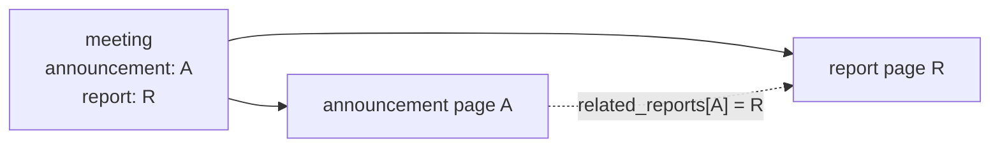

# page_builder — rendering content dicts into HTML

## Role in the build

`content_manager` produces dicts; `page_builder` turns them into HTML using
Jinja templates and writes files into `output/`. It owns three kinds of work:

- **Detail pages**: one HTML file per item (`output/news/<id>.html`, and so on).
- **Card fragments**: HTML snippets (news cards, meeting cards) that a listing
  page embeds.
- **Whole pages**: a template plus context written to one output file.



## Banners: override with fallback

Every page shows a banner image with a title. `resolve_banner` lets any page
override it from its own frontmatter and otherwise falls back to site defaults:

```python
image = metadata.get("banner_image") or self.site_config.get(
    "default_banner_image", ""
)
```

The subtle part is **`path_prefix`**. Images are specified relative to the site
root, but a detail page lives one directory deeper, so it must reference
`../images/...`. The prefix is applied to whichever image wins, override or
default, so authors never have to think about page depth.

## Detail pages: one generic loop

`build_detail_pages` renders every item of a content type with that type's
detail template:

- Dates are pre-formatted for display.
- The item is passed under the name its template expects (`post`, `project`,
  `member`, `meeting`), via a small lookup table.
- Banner context and any extra context (cross-link maps) are merged in.
- **Meetings get extra resolution**: announcement, report, and slides links.

The lookup table for the variable name is a *table-driven* substitute for a
branch per type.

## Meeting cross-links

Meetings connect to news posts in two directions, and the module resolves both
from **the meeting's own fields only**, so nothing is maintained twice.



- `resolve_announcement_report` gives a meeting's templates
  `announcement_exists`, `report_html`, `slides_pdf`, and so on, optionally
  prefixed (`main_...`) when a template shows several meetings.
- `build_related_reports_map` inverts that relation, so an **announcement page
  can link forward to its report** without the announcement file having to know
  the report exists.

The slides PDF lookup deliberately suppresses `ValueError`: a missing slides
file means "no download button", not a failed build.

## Cards

`render_cards` is the generic fragment renderer. It supports two template
styles:

- **Nested**: the template expects `project.title`, so the item is passed under
  a name.
- **Flat**: the template expects `title` directly, so the item's keys are spread
  into the context.

Thin wrappers (`render_news_cards`, `render_member_cards`, …) adapt specific
content (for example flattening member metadata into `name`, `hashtags`,
`card_text`) and pick the template.

## Grouping meetings by month

The meetings page shows one card per month, pairing that month's main and
hands-on meetings. `group_meetings_by_month` builds this with a
**`defaultdict` keyed by `YYYY-MM`**:

```python
month_groups = defaultdict(lambda: {"main": None, "handson": None})
...
month_groups[month_key][slot] = meeting
```

- `YYYY-MM` strings sort **lexically in chronological order**, so a plain
  `sorted(..., reverse=True)` gives newest-first with no date parsing.
- Two meetings of the same kind in one month would collide; the code **warns**
  and the later one wins, rather than silently dropping one.

## The home-page rail

`render_upcoming_meetings_calendar` shows meetings in a **60-day window** from
today, both kinds, with an announcement link when one resolves. It's a
sliding-window filter over the meeting list followed by a sort.

## Observations and possible improvements

1. **The file is past the ~300-line guideline** (about 390 lines). Meeting-specific
   rendering (grouping, rail, cross-links) could move to its own module.
2. **Two "upcoming" definitions exist.** The rail uses a 60-day window here,
   while `content_manager.get_future_meetings` has no window. That's a real
   product difference, but the date filtering itself is duplicated.
3. **`render_cards` sniffs the template name** (`"compact-meeting-card" in
   template_name`) to decide whether to add meeting context. Passing that as an
   explicit option would be clearer and less fragile.
4. **`build_page` and the `.txt`/`.ics` builders overlap.** All three render a
   template with `site` in context and write a file; only the encoding differs.
   An `encoding`/post-process parameter would let the feeds reuse it.
