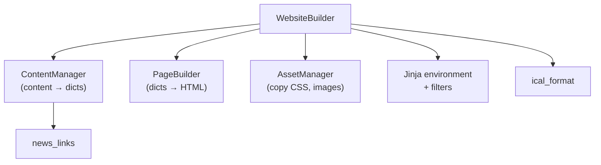
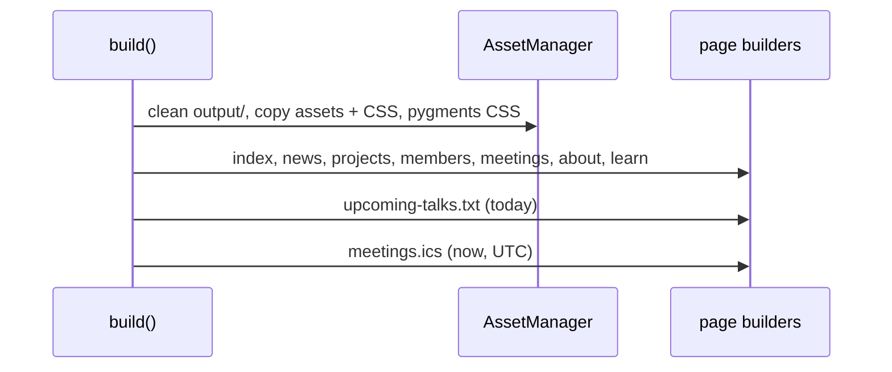

# build — orchestrating the whole site

## Theory of operation

`build.py` is the entry point: `uv run python build/build.py` produces the
complete static site in `output/`, which GitHub Pages then serves. It does
little work itself. Its job is **wiring**: construct the collaborators, define
the content types, and call each page builder in order.



## Setup: paths, config, and Jinja

The constructor resolves the project root, loads `config/site.json`, and builds
one shared Jinja environment with three custom filters:

- `format_date` → "October 15, 2026" for cards and pages.
- `long_date` → "Thursday, October 15, 2026" for the talks list.
- `ics_text` → RFC 5545 escaping for the calendar feed.

One environment shared by every collaborator means templates behave identically
wherever they're rendered.

The root is detected from the **current working directory's name** (`build/`
vs. repo root). That works for both documented invocations, but it's inference
from a naming convention; F16 proposes deriving it from `__file__` instead.

## Content types as data

Each content kind is declared once as a `ContentType`: directory, sort order,
detail template, listing template, output filename. For example, meetings sort
by date descending and render `details/meeting-detail.html`. The page builders
then look types up by name instead of repeating that configuration.

## The page builders

Each `build_*_page` method follows the same recipe:

1. Load content through `ContentManager`.
2. Optionally build detail pages (with cross-link maps).
3. Render the listing fragment.
4. Load the page's hero and banner.
5. Write the page with `PageBuilder.build_page`.

The interesting variation is in **cross-linking**. `build_projects_page` builds
a map from project slug to the members working on it, by inverting each
member's `projects` list:

```python
for member in members:
    for slug in member["metadata"].get("projects", []):
        members_map.setdefault(slug, []).append({...})
```

That's a classic *inverted index*: members declare projects, and the build
derives the reverse relation so project pages can list members without anyone
maintaining it by hand. `build_members_page` builds the forward map, with
different relative URLs for detail pages (`../projects/...`) and the listing
page (`projects/...`).

`parse_learn_sections` is the odd one out: it parses `learn.md` by splitting on
`---` and matching link lines with regexes, turning a Markdown resource list
into structured cards with icons chosen by keyword.

## The two feeds

Two outputs aren't HTML pages, and both validate their config first:

```python
def require_config(self, *keys: str):
    for key in keys:
        if not self.site_config.get(key):
            raise ValueError(f"config/site.json is missing {key!r}")
```

- **`build_upcoming_talks(today)`** renders `upcoming-talks.txt` for pasting
  into emails. It's written with a **UTF-8 BOM** so browsers decode em dashes
  correctly even when a server's `text/plain` header omits the charset.
- **`build_ical_feed(stamp)`** renders `meetings.ics`, pipes it through
  `fold_ics`, and writes **bytes** so CRLF line endings survive on every
  platform. It also validates that `meeting_duration_minutes` is a positive
  integer.

Both take the date or time as a **parameter** rather than reading the clock
themselves. `build()` passes the real now; tests pass a frozen date. That's
simple dependency injection for time, the most common source of flaky tests.

## The build sequence



The output directory is wiped first, so every build is **from scratch**, with no
stale pages left over from deleted content.

## Observations and possible improvements

1. **Repeated hero/banner envelope.** Six page methods repeat the same
   `build_hero_content` + `resolve_banner` + `build_page` tail. F14 proposes a
   helper for it.
2. **CWD-based root detection** is fragile for IDEs and automation. F16 proposes
   `Path(__file__).resolve().parent.parent`.
3. **The file is past the ~300-line guideline** (about 400 lines).
   `parse_learn_sections` is self-contained parsing logic and would sit better
   in its own module.
4. **`build/` isn't a package**, so modules import each other as top-level
   names via `sys.path` tricks. F12 covers making it a proper package.
